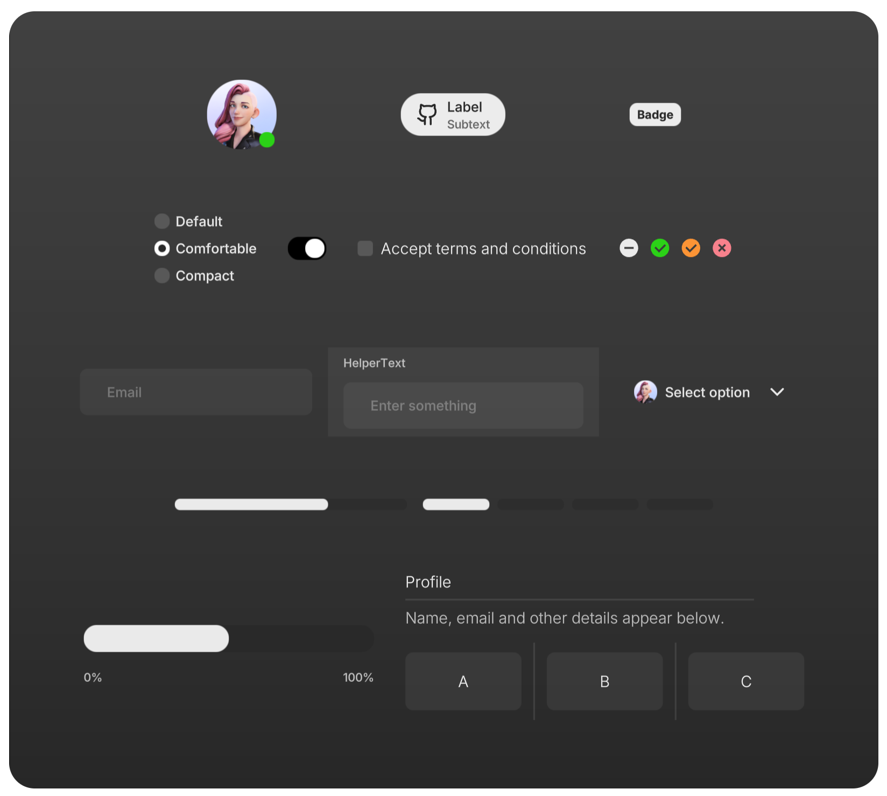

<p align="center">
  
</p>

<h1 align="center">uikit</h1>
<h3 align="center">Build performant 3D user interfaces for threejs.</h3>
<br/>

<p align="center">
  <a href="https://npmjs.com/package/@react-three/uikit" target="_blank">
    
  </a>
  <a href="https://npmjs.com/package/@react-three/uikit" target="_blank">
    
  </a>
  <a href="https://twitter.com/pmndrs" target="_blank">
    
  </a>
  <a href="https://discord.gg/ZZjjNvJ" target="_blank">
    
  </a>
</p>

> Perfect for games, XR (VR/AR), and any web-based Spatial Computing App.

### What does it look like?

| A simple UI with 2 containers horizontally aligned, rendered in fullscreen. When the user hovers over a container, the container's opacity changes. |  |
| --------------------------------------------------------------------------------------------------------------------------------------------------- | --------------------------------------------------------------------- |

Source code when using `@react-three/uikit`:

```jsx
import { createRoot } from 'react-dom/client'
import React from 'react'
import { Canvas } from '@react-three/fiber'
import { Fullscreen, Container } from '@react-three/uikit'

createRoot(document.getElementById('root')).render(
  <Canvas>
    <Fullscreen flexDirection="row" padding={10} gap={10}>
      <Container flexGrow={1} opacity={0.5} hover={{ opacity: 1 }} backgroundColor="red" />
      <Container flexGrow={1} opacity={0.5} hover={{ opacity: 1 }} backgroundColor="blue" />
    </Fullscreen>
  </Canvas>,
)
```

## How to get started

If you are using `@react-three/fiber`, get started with **[building your first layout](https://docs.pmnd.rs/uikit/getting-started/first-layout)**, take a look at our **[examples](https://docs.pmnd.rs/uikit/getting-started/examples)** to see uikit in action. If you want to use vanilla three.js, visit [this tutorial](https://pmndrs.github.io/uikit/docs/getting-started/vanilla). Alternatively, learn more about:

- [All components and their properties](https://docs.pmnd.rs/uikit/getting-started/components-and-properties)
- [Interactivity](https://docs.pmnd.rs/uikit/tutorials/interactivity)
- [Custom materials](https://docs.pmnd.rs/uikit/tutorials/custom-materials)
- [Custom fonts](https://docs.pmnd.rs/uikit/tutorials/custom-fonts)
- [Responsive user interfaces](https://docs.pmnd.rs/uikit/tutorials/responsive)
- [Scrolling](https://docs.pmnd.rs/uikit/tutorials/scroll)
- [Sizing](https://docs.pmnd.rs/uikit/tutorials/sizing)
- [Common pitfalls](https://docs.pmnd.rs/uikit/advanced/pitfalls)
- [Optimize performance](https://docs.pmnd.rs/uikit/advanced/performance)
- [Theming components](https://docs.pmnd.rs/uikit/advanced/theming)

## Pre-styled component kits

We provide multiple kits containing **themable pre-styled components**.

| <h3>default</h3> _based on [Shadcn](https://github.com/shadcn-ui/ui)_                | <h3>horizon-kit</h3> _based on [RLDS](https://www.figma.com/de-de/community/file/1509641173090552632/meta-horizon-os-ui-set)_ |
| ------------------------------------------------------------------------------------ | ----------------------------------------------------------------------------------------------------------------------------- |
|  |                                           |
| [View All Components](https://docs.pmnd.rs/uikit/default-kit/accordion)              | [View All Components](https://docs.pmnd.rs/uikit/default-kit/avatar)                                                          |
| install via `@react-three/uikit-default` or `@pmndrs/uikit-default`                  | install via `@react-three/uikit-horizon` or `@pmndrs/uikit-horizon`                                                           |

## Migration guides

- from [Uikit 0.\*](https://pmndrs.github.io/uikit/docs/migration/from-version-0)

## Sponsors

This project is supported by a few companies and individuals building cutting edge 3D Web & XR experiences. Check them out!


