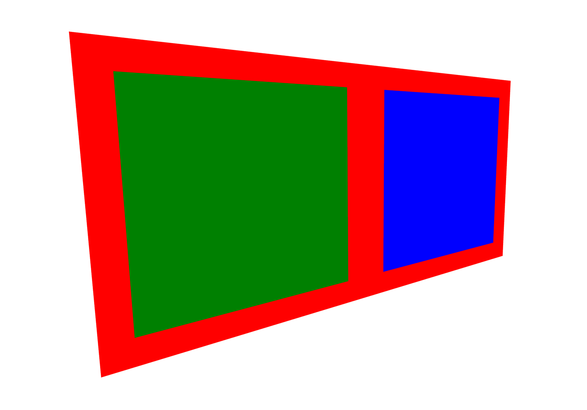

The first step for building a layout is to install the dependencies.

`npm i @react-three/fiber @react-three/uikit react react-dom three @react-three/drei`

> The `@react-three/drei` dependency is not necessary but allows us to add `OrbitControls`.

Next, we create the `index.jsx` file and import the necessary dependencies.

```jsx
import { Canvas } from "@react-three/fiber";
import { OrbitControls } from "@react-three/drei";
import { Root, Container } from "@react-three/uikit";
import { createRoot } from "react-dom/client";
```

Now, we can start defining the actual layout. Every layout must start with a `Root` element (or an element that wraps the `Root` element, such as the `Fullscreen` component). In this example, the `Root` is of size 2 by 1 (three.js units). The `Root` has a horizontal (row) flex-direction, with 2 `Container` children, filling its width equally with a margin around them.

More in-depth information on the Flexbox properties can be found [here](https://yogalayout.dev/docs/).

```jsx
createRoot(document.getElementById("root")).render(
  <Canvas>
    <OrbitControls />
    <Root backgroundColor="red" sizeX={2} sizeY={1} flexDirection="row">
      <Container flexGrow={1} margin={48} backgroundColor="green" />
      <Container flexGrow={1} margin={48} backgroundColor="blue" />
    </Root>
  </Canvas>
);
```

If you use vite (`npm i vite`), you can create a `index.html` file, add the following content, and run `npx vite`.

```html
<!DOCTYPE html>
<html lang="en">
<head>
    <meta charset="UTF-8">
    <meta name="viewport" content="width=device-width, initial-scale=1.0">
    <title>Document</title>
    <script type="module" src="index.jsx"></script>
</head>
<body style="margin: 0;">
    <div id="root" style="width: 100dvw; height: 100dvh;"></div>
</body>
</html>
```

The result should look like this
