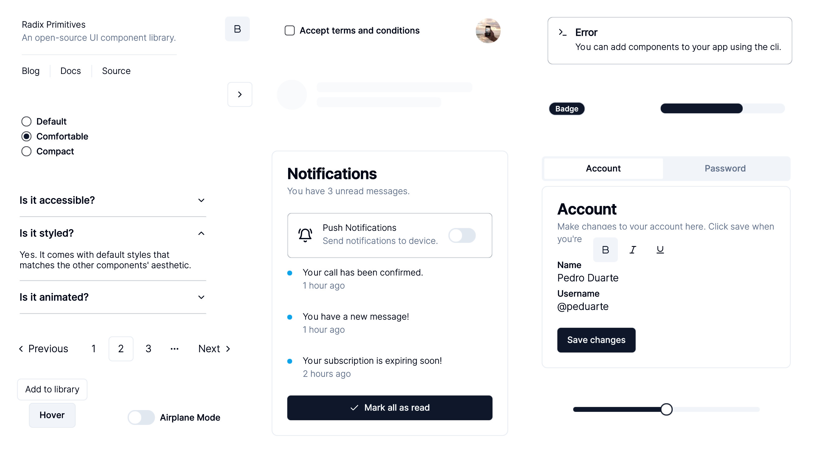
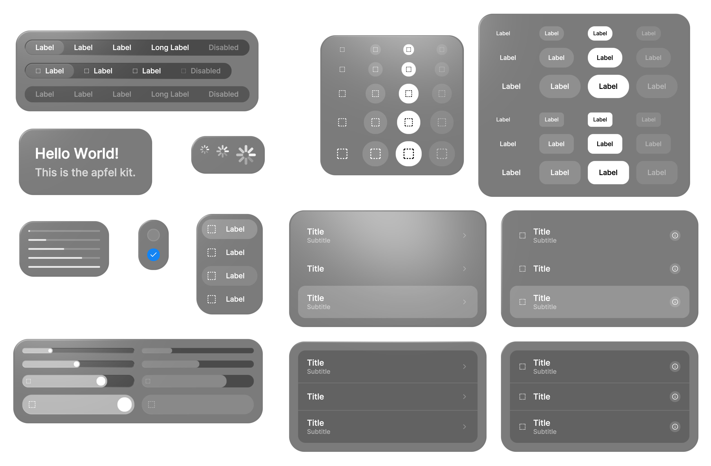

> Perfect for games, XR (VR/AR), and any web-based Spatial Computing App.

```bash
npm install three @react-three/fiber @react-three/uikit
```

### What does it look like?

<Sandpack
  template="react-ts"
  customSetup={{
    dependencies: {
      'three': 'latest',
      '@react-three/fiber': '<9',
      '@react-three/uikit': 'latest',
      '@react-three/drei': '<10',
    },
  }}
  files={{
    '/App.tsx': `import { Canvas } from "@react-three/fiber";
import { Fullscreen, Container } from "@react-three/uikit";

export default function App() {
  return (
    <Canvas style={{ position: "absolute", inset: "0", touchAction: "none" }} gl={{ localClippingEnabled: true }}>
      <Fullscreen flexDirection="row" padding={10} gap={10}>
        <Container flexGrow={1} backgroundOpacity={0.5} hover={{ backgroundOpacity: 1 }} backgroundColor="red" />
        <Container flexGrow={1} backgroundOpacity={0.5} hover={{ backgroundOpacity: 1 }} backgroundColor="blue" />
      </Fullscreen>
    </Canvas>
  )
}`}}
/>


## How to get started

> Some familiarity with
react, threejs, and @react-three/fiber, is recommended.

Get started with **[building your first layout](./first-layout.md)**, take a look at our **[examples](./examples.md)** to see uikit in action, or learn more about:

- [All components and their properties](./components-and-properties.md)
- [Interactivity](../tutorials/interactivity.mdx)
- [Custom materials](../tutorials/custom-materials.md)
- [Custom fonts](../tutorials/custom-fonts.md)
- [Responsive user interfaces](../tutorials/responsive.md)
- [Scrolling](../tutorials/scroll.md)
- [Sizing](../tutorials/sizing.md)
- [Common pitfalls](../advanced/pitfalls.md)
- [Optimize performance](../advanced/performance.md)
- [Theming components](../advanced/theming.mdx)

## Pre-styled component kits

We provide multiple kits containing **themable pre-styled components**. Inspired by shadcn, you can use our CLI to install the source code of any component to your desired location with one command.
> For example, to add the button from the default kit, run: `npx uikit component add default Button`

| <h3>default</h3> _based on [Shadcn](https://github.com/shadcn-ui/ui)_ | <h3>apfel</h3> _inspired by AVP_                            |
| --------------------------------------------------------------------- | ----------------------------------------------------------- |
|                                                                       |  |
| [View All Components](../default-kit/accordion.mdx)                             | [View All Components](../apfel-kit/button.mdx)                     |
| `npx uikit component add default Button`                                  | `npx uikit component add apfel Button`                          |

## Migration guides

- from [Koestlich](../migration/from-koestlich.md)
- from [HTML/CSS](../migration/from-html-css.md)
- from [Tailwind](../migration/from-tailwind.md)


## Sponsors 

This project is supported by a few companies and individuals building cutting edge 3D Web & XR experiences. Check them out!


