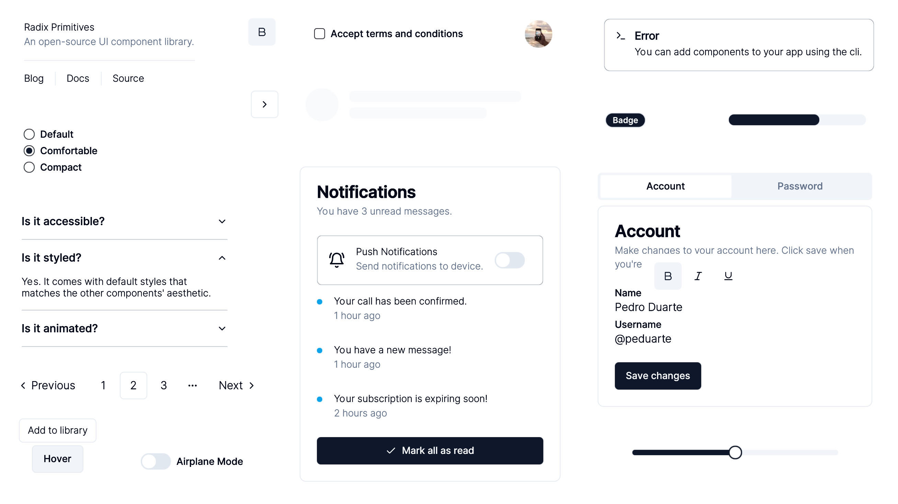
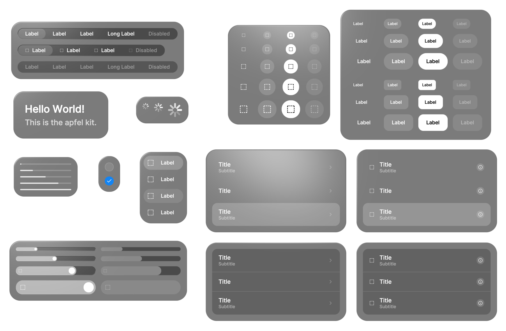

> A vanilla-first 3D UI toolkit. Perfect for games, XR (VR/AR), and any web-based Spatial Computing App.

```bash
npm install three @ni2khanna/uikit
```

### What does it look like?

```ts
import { PerspectiveCamera, Scene, WebGLRenderer } from 'three'
import { reversePainterSortStable, Fullscreen, Container } from '@ni2khanna/uikit'
import { forwardHtmlEvents } from '@pmndrs/pointer-events'

const canvas = document.getElementById('root') as HTMLCanvasElement
const renderer = new WebGLRenderer({ antialias: true, canvas })
renderer.localClippingEnabled = true
renderer.setTransparentSort(reversePainterSortStable)

const camera = new PerspectiveCamera(70, 1, 0.01, 100)
camera.position.z = 5
const scene = new Scene()
scene.add(camera)

const { update } = forwardHtmlEvents(canvas, camera, scene)

const root = new Fullscreen(renderer, {
  flexDirection: 'row',
  padding: 10,
  gap: 10,
})
camera.add(root)

root.add(new Container({ flexGrow: 1, opacity: 0.5, hover: { opacity: 1 }, backgroundColor: 'red' }))
root.add(new Container({ flexGrow: 1, opacity: 0.5, hover: { opacity: 1 }, backgroundColor: 'blue' }))

function updateSize() {
  renderer.setSize(window.innerWidth, window.innerHeight)
  camera.aspect = window.innerWidth / window.innerHeight
  camera.updateProjectionMatrix()
}
updateSize()
window.addEventListener('resize', updateSize)

let prev: number | undefined
renderer.setAnimationLoop((time: number) => {
  const delta = prev == null ? 0 : time - prev
  prev = time
  update()
  root.update(delta)
  renderer.render(scene, camera)
})
```

## How to get started

> Some familiarity with Three.js is recommended.

Get started with **[building your first layout](./first-layout.md)**, take a look at our **[examples](./examples.md)** to see uikit in action, or learn more about:

- [All components and their properties](./components-and-properties.md)
- [Interactivity](../tutorials/interactivity.mdx)
- [Custom materials](../tutorials/custom-materials.md)
- [Custom fonts](../tutorials/custom-fonts.md)
- [Responsive user interfaces](../tutorials/responsive.md)
- [Scrolling](../tutorials/scroll.md)
- [Sizing](../tutorials/sizing.md)
- [Common pitfalls](../advanced/pitfalls.md)
- [Optimize performance](../advanced/performance.md)
- [Theming components](../advanced/theming.mdx)

## Pre-styled component kits

We provide multiple kits containing **themable pre-styled components**.

| <h3>default</h3> _based on [Shadcn](https://github.com/shadcn-ui/ui)_ | <h3>apfel</h3> _inspired by AVP_                            |
| --------------------------------------------------------------------- | ----------------------------------------------------------- |
|        |  |
| [View All Components](../default-kit/accordion.mdx)                   | [View All Components](../apfel-kit/button.mdx)              |
| `npm i @ni2khanna/uikit-default`                                    | `npm i @ni2khanna/uikit-apfel`                            |

## Migration guides

- from [Koestlich](../migration/from-koestlich.md)
- from [HTML/CSS](../migration/from-html-css.md)
- from [Tailwind](../migration/from-tailwind.md)
