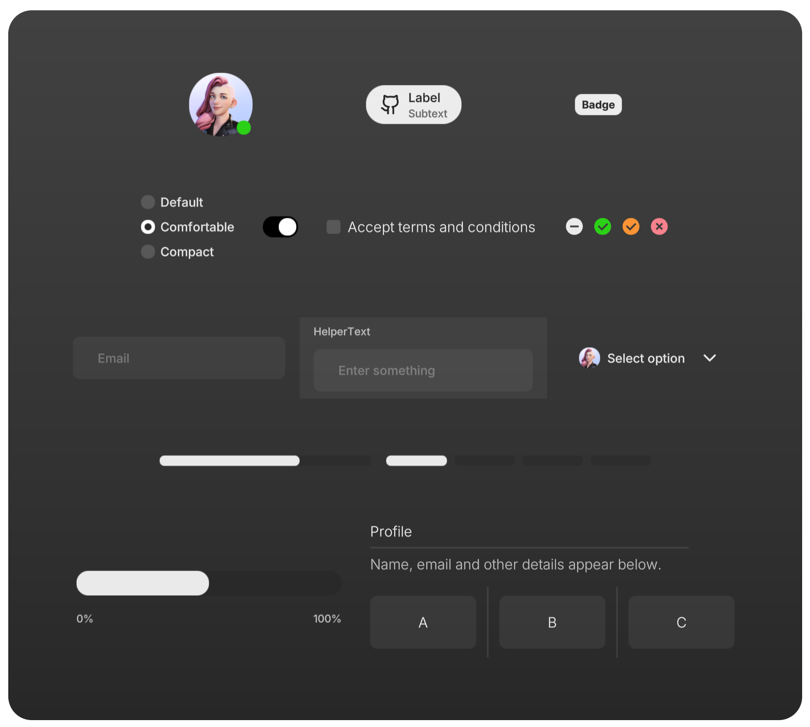

> Perfect for games, XR (VR/AR), and any web-based Spatial Computing App.

```bash
npm install three @react-three/fiber @react-three/uikit
```

### What does it look like?

<Sandpack
  template="react-ts"
  customSetup={{
    dependencies: {
      'three': 'latest',
      '@react-three/fiber': '<9',
      '@react-three/uikit': '^1.0.44',
      '@react-three/drei': '<10',
    },
  }}
  files={{
    '/App.tsx': `import { Canvas } from "@react-three/fiber";
import { Fullscreen, Container } from "@react-three/uikit";

export default function App() {
  return (
    <Canvas style={{ position: "absolute", inset: "0", touchAction: "none" }} gl={{ localClippingEnabled: true }}>
      <Fullscreen flexDirection="row" padding={10} gap={10}>
        <Container flexGrow={1} opacity={0.5} hover={{ opacity: 1 }} backgroundColor="red" />
        <Container flexGrow={1} opacity={0.5} hover={{ opacity: 1 }} backgroundColor="blue" />
      </Fullscreen>
    </Canvas>
  )
}`}}
/>

## How to get started

If you are using `@react-three/fiber`, get started with **[building your first layout](./first-layout.mdx)**, take a look at our **[examples](./examples.md)** to see uikit in action. If you want to use vanilla three.js, visit [this tutorial](./vanilla.md). Alternatively, learn more about:

- [All components and their properties](./components-and-properties.md)
- [Globals (defaults, classes, color scheme)](./globals.mdx)
- [Interactivity](../tutorials/interactivity.mdx)
- [Custom materials](../tutorials/custom-materials.md)
- [Custom fonts](../tutorials/custom-fonts.md)
- [Responsive user interfaces](../tutorials/responsive.md)
- [Scrolling](../tutorials/scroll.md)
- [Sizing](../tutorials/sizing.md)
- [Common pitfalls](../advanced/pitfalls.md)
- [Optimize performance](../advanced/performance.md)
- [Theming components](../advanced/theming.mdx)

## Pre-styled component kits

We provide multiple kits containing **themable pre-styled components**.

| <h3>default-kit</h3> _based on [Shadcn](https://github.com/shadcn-ui/ui)_ | <h3>horizon-kit</h3> _based on [RLDS](https://www.figma.com/de-de/community/file/1509641173090552632/meta-horizon-os-ui-set)_ |
| ------------------------------------------------------------------------- | ----------------------------------------------------------------------------------------------------------------------------- |
|            |                                                                |
| [View All Components](../default-kit/accordion.mdx)                       | [View All Components](../horizon-kit/avatar.mdx)                                                                              |
| install via `@react-three/uikit-default` or `@pmndrs/uikit-default`       | install via `@react-three/uikit-horizon` or `@pmndrs/uikit-horizon`                                                           |

## Migration guides

- from [Uikit 0.\*](../migration/from-version-0.md)

## Sponsors

This project is supported by a few companies and individuals building cutting edge 3D Web & XR experiences. Check them out!


