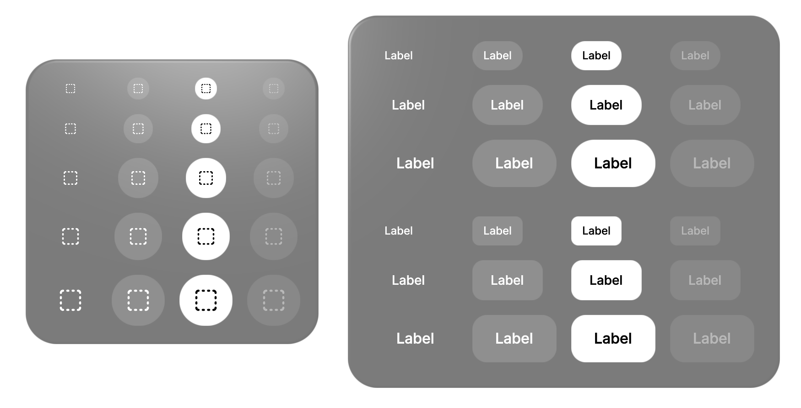
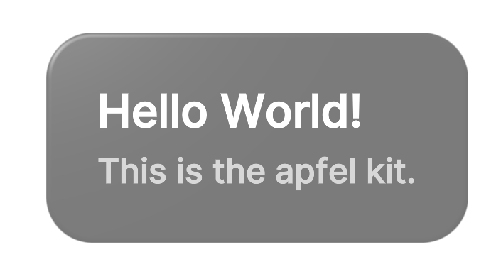
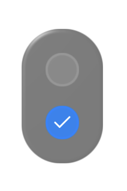
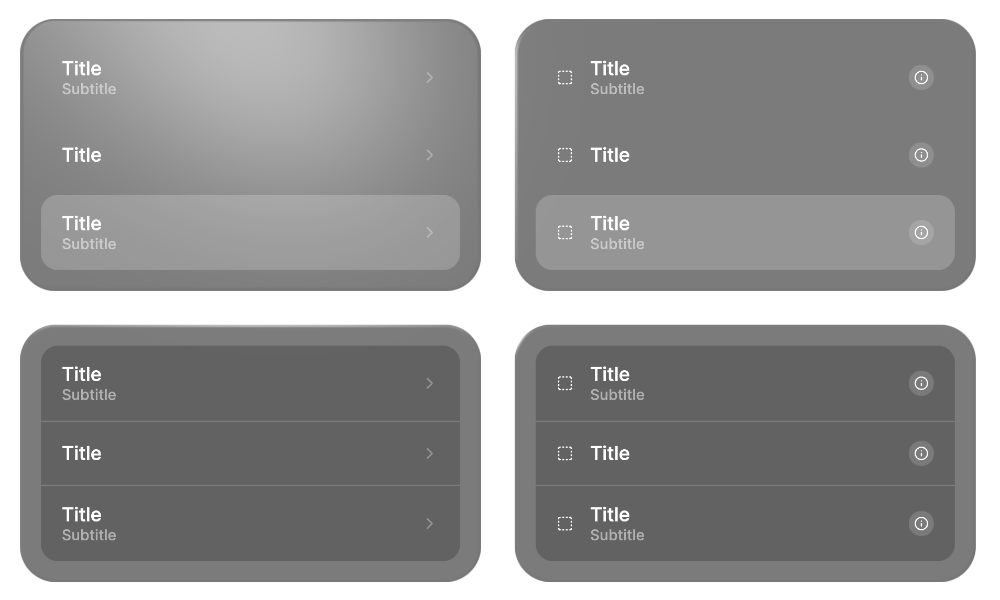
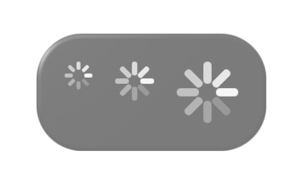
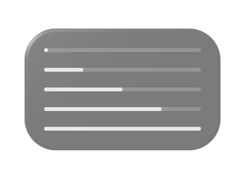
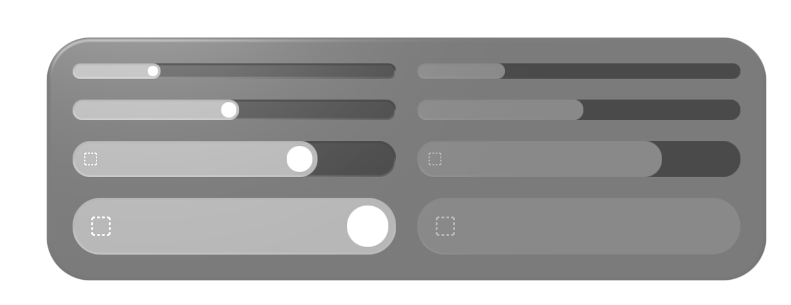
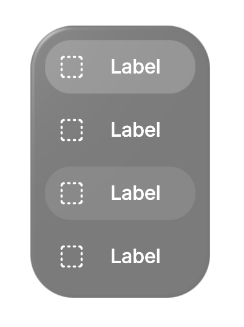
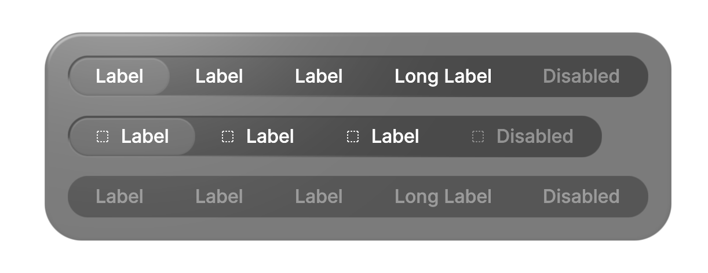
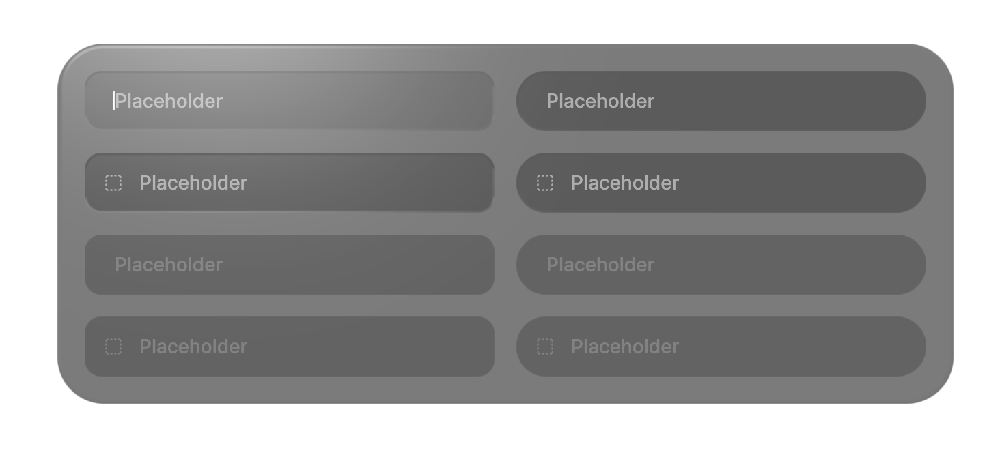

  
## Button


<details>
<summary>Code</summary>

```tsx
import { Container, Text } from '@react-three/uikit'
import { Card } from '@/card.js'
import { Button } from '@/button.js'
import { BoxSelect } from '@react-three/uikit-lucide'

export function ButtonsOnCard() {
  return (
    <Container flexDirection="column" md={{ flexDirection: 'row' }} alignItems="center" gap={32}>
      <Card borderRadius={32} padding={16}>
        <Container flexDirection="row" gapColumn={16}>
          <Container flexDirection="column" justifyContent="space-between" alignItems="center" gapRow={16}>
            <Button variant="icon" size="xs">
              <BoxSelect />
            </Button>
            <Button variant="icon" size="sm">
              <BoxSelect />
            </Button>
            <Button variant="icon" size="md">
              <BoxSelect />
            </Button>
            <Button variant="icon" size="lg">
              <BoxSelect />
            </Button>
            <Button variant="icon" size="xl">
              <BoxSelect />
            </Button>
          </Container>
          <Container flexDirection="column" justifyContent="space-between" alignItems="center" gapRow={16}>
            <Button variant="icon" size="xs" platter>
              <BoxSelect />
            </Button>
            <Button variant="icon" size="sm" platter>
              <BoxSelect />
            </Button>
            <Button variant="icon" size="md" platter>
              <BoxSelect />
            </Button>
            <Button variant="icon" size="lg" platter>
              <BoxSelect />
            </Button>
            <Button variant="icon" size="xl" platter>
              <BoxSelect />
            </Button>
          </Container>
          <Container flexDirection="column" justifyContent="space-between" alignItems="center" gapRow={16}>
            <Button variant="icon" size="xs" selected>
              <BoxSelect />
            </Button>
            <Button variant="icon" size="sm" selected>
              <BoxSelect />
            </Button>
            <Button variant="icon" size="md" selected>
              <BoxSelect />
            </Button>
            <Button variant="icon" size="lg" selected>
              <BoxSelect />
            </Button>
            <Button variant="icon" size="xl" selected>
              <BoxSelect />
            </Button>
          </Container>
          <Container flexDirection="column" justifyContent="space-between" alignItems="center" gapRow={16}>
            <Button variant="icon" size="xs" disabled>
              <BoxSelect />
            </Button>
            <Button variant="icon" size="sm" disabled>
              <BoxSelect />
            </Button>
            <Button variant="icon" size="md" disabled>
              <BoxSelect />
            </Button>
            <Button variant="icon" size="lg" disabled>
              <BoxSelect />
            </Button>
            <Button variant="icon" size="xl" disabled>
              <BoxSelect />
            </Button>
          </Container>
        </Container>
      </Card>

      <Card borderRadius={32} padding={24}>
        <Container flexDirection="column" gapRow={32}>
          <Container flexDirection="row" gapColumn={16}>
            <Container flexDirection="column" alignItems="flex-start" gapRow={16}>
              <Button variant="pill" size="sm">
                <Text>Label</Text>
              </Button>
              <Button variant="pill" size="md">
                <Text>Label</Text>
              </Button>
              <Button variant="pill" size="lg">
                <Text>Label</Text>
              </Button>
            </Container>
            <Container flexDirection="column" alignItems="flex-start" gapRow={16}>
              <Button variant="pill" size="sm" platter>
                <Text>Label</Text>
              </Button>
              <Button variant="pill" size="md" platter>
                <Text>Label</Text>
              </Button>
              <Button variant="pill" size="lg" platter>
                <Text>Label</Text>
              </Button>
            </Container>
            <Container flexDirection="column" alignItems="flex-start" gapRow={16}>
              <Button variant="pill" size="sm" selected>
                <Text>Label</Text>
              </Button>
              <Button variant="pill" size="md" selected>
                <Text>Label</Text>
              </Button>
              <Button variant="pill" size="lg" selected>
                <Text>Label</Text>
              </Button>
            </Container>
            <Container flexDirection="column" alignItems="flex-start" gapRow={16}>
              <Button variant="pill" size="sm" disabled>
                <Text>Label</Text>
              </Button>
              <Button variant="pill" size="md" disabled>
                <Text>Label</Text>
              </Button>
              <Button variant="pill" size="lg" disabled>
                <Text>Label</Text>
              </Button>
            </Container>
          </Container>

          <Container flexDirection="row" gapColumn={16}>
            <Container flexDirection="column" alignItems="flex-start" gapRow={16}>
              <Button variant="rect" size="sm">
                <Text>Label</Text>
              </Button>
              <Button variant="rect" size="md">
                <Text>Label</Text>
              </Button>
              <Button variant="rect" size="lg">
                <Text>Label</Text>
              </Button>
            </Container>
            <Container flexDirection="column" alignItems="flex-start" gapRow={16}>
              <Button variant="rect" size="sm" platter>
                <Text>Label</Text>
              </Button>
              <Button variant="rect" size="md" platter>
                <Text>Label</Text>
              </Button>
              <Button variant="rect" size="lg" platter>
                <Text>Label</Text>
              </Button>
            </Container>
            <Container flexDirection="column" alignItems="flex-start" gapRow={16}>
              <Button variant="rect" size="sm" selected>
                <Text>Label</Text>
              </Button>
              <Button variant="rect" size="md" selected>
                <Text>Label</Text>
              </Button>
              <Button variant="rect" size="lg" selected>
                <Text>Label</Text>
              </Button>
            </Container>
            <Container flexDirection="column" alignItems="flex-start" gapRow={16}>
              <Button variant="rect" size="sm" disabled>
                <Text>Label</Text>
              </Button>
              <Button variant="rect" size="md" disabled>
                <Text>Label</Text>
              </Button>
              <Button variant="rect" size="lg" disabled>
                <Text>Label</Text>
              </Button>
            </Container>
          </Container>
        </Container>
      </Card>
    </Container>
  )
}

```

</details>

[Live View](https://pmndrs.github.io/uikit/examples/apfel/?component=button)   
```bash
npx uikit component add apfel button
```

## Card


<details>
<summary>Code</summary>

```tsx
import { Text } from '@react-three/uikit'
import { Card } from '@/card.js'

export function TextOnCard() {
  return (
    <Card borderRadius={32} padding={32} gap={8} flexDirection="column">
      <Text fontSize={32}>Hello World!</Text>
      <Text fontSize={24} opacity={0.7}>
        This is the apfel kit.
      </Text>
    </Card>
  )
}

```

</details>

[Live View](https://pmndrs.github.io/uikit/examples/apfel/?component=card)   
```bash
npx uikit component add apfel card
```

## Checkbox


<details>
<summary>Code</summary>

```tsx
import { Card } from '@/card.js'
import { Checkbox } from '@/checkbox.js'

export function CheckboxOnCard() {
  return (
    <Card borderRadius={32} padding={16} flexDirection="column" gapRow={16}>
      <Checkbox disabled defaultSelected={false} />
      <Checkbox defaultSelected={true} />
    </Card>
  )
}

```

</details>

[Live View](https://pmndrs.github.io/uikit/examples/apfel/?component=checkbox)   
```bash
npx uikit component add apfel checkbox
```

## List


<details>
<summary>Code</summary>

```tsx
import { Text, Container } from '@react-three/uikit'
import { BoxSelect, ChevronRight, Info } from '@react-three/uikit-lucide'
import { Card } from '@/card.js'
import { List, ListItem } from '@/list.js'
import { Button } from '@/button.js'

export function ListsOnCard() {
  return (
    <Container flexDirection="column" gapRow={32} alignItems="center">
      <Container flexDirection="column" md={{ flexDirection: 'row' }} gap={32}>
        <Card flexDirection="column" borderRadius={32} padding={16}>
          <List type="plain" width={400}>
            <ListItem
              subtitle={<Text>Subtitle</Text>}
              trailingAccessory={<ChevronRight height={18} width={18} opacity={0.3} />}
            >
              <Text>Title</Text>
            </ListItem>
            <ListItem trailingAccessory={<ChevronRight height={18} width={18} opacity={0.3} />}>
              <Text>Title</Text>
            </ListItem>
            <ListItem
              subtitle={<Text>Subtitle</Text>}
              selected
              trailingAccessory={<ChevronRight height={18} width={18} opacity={0.3} />}
            >
              <Text>Title</Text>
            </ListItem>
          </List>
        </Card>
        <Card flexDirection="column" borderRadius={32} padding={16}>
          <List type="plain" width={400}>
            <ListItem
              subtitle={<Text>Subtitle</Text>}
              leadingAccessory={<BoxSelect height={16} width={16} />}
              trailingAccessory={
                <Button variant="icon" size="xs" platter>
                  <Info height={14} width={14} />
                </Button>
              }
            >
              <Text>Title</Text>
            </ListItem>
            <ListItem
              leadingAccessory={<BoxSelect height={16} width={16} />}
              trailingAccessory={
                <Button variant="icon" size="xs" platter>
                  <Info height={14} width={14} />
                </Button>
              }
            >
              <Text>Title</Text>
            </ListItem>
            <ListItem
              subtitle={<Text>Subtitle</Text>}
              selected
              leadingAccessory={<BoxSelect height={16} width={16} />}
              trailingAccessory={
                <Button variant="icon" size="xs" platter>
                  <Info height={14} width={14} />
                </Button>
              }
            >
              <Text>Title</Text>
            </ListItem>
          </List>
        </Card>
      </Container>
      <Container flexDirection="column" md={{ flexDirection: 'row' }} gap={32}>
        <Card flexDirection="column" borderRadius={32} padding={16}>
          <List type="inset" width={400}>
            <ListItem
              isFirst
              subtitle={<Text>Subtitle</Text>}
              trailingAccessory={<ChevronRight height={18} width={18} opacity={0.3} />}
            >
              <Text>Title</Text>
            </ListItem>
            <ListItem trailingAccessory={<ChevronRight height={18} width={18} opacity={0.3} />}>
              <Text>Title</Text>
            </ListItem>
            <ListItem
              isLast
              subtitle={<Text>Subtitle</Text>}
              trailingAccessory={<ChevronRight height={18} width={18} opacity={0.3} />}
            >
              <Text>Title</Text>
            </ListItem>
          </List>
        </Card>
        <Card flexDirection="column" borderRadius={32} padding={16}>
          <List type="inset" width={400}>
            <ListItem
              isFirst
              subtitle={<Text>Subtitle</Text>}
              leadingAccessory={<BoxSelect height={16} width={16} />}
              trailingAccessory={
                <Button variant="icon" size="xs" platter>
                  <Info height={14} width={14} />
                </Button>
              }
            >
              <Text>Title</Text>
            </ListItem>
            <ListItem
              leadingAccessory={<BoxSelect height={16} width={16} />}
              trailingAccessory={
                <Button variant="icon" size="xs" platter>
                  <Info height={14} width={14} />
                </Button>
              }
            >
              <Text>Title</Text>
            </ListItem>
            <ListItem
              isLast
              subtitle={<Text>Subtitle</Text>}
              leadingAccessory={<BoxSelect height={16} width={16} />}
              trailingAccessory={
                <Button variant="icon" size="xs" platter>
                  <Info height={14} width={14} />
                </Button>
              }
            >
              <Text>Title</Text>
            </ListItem>
          </List>
        </Card>
      </Container>
    </Container>
  )
}

```

</details>

[Live View](https://pmndrs.github.io/uikit/examples/apfel/?component=list)   
```bash
npx uikit component add apfel list
```

## Loading


<details>
<summary>Code</summary>

```tsx
import { Card } from '@/card.js'
import { Loading } from '@/loading.js'

export function LoadingSpinnersOnCard() {
  return (
    <Card borderRadius={32} padding={16} flexDirection="row" gapColumn={16}>
      <Loading size="sm" />
      <Loading size="md" />
      <Loading size="lg" />
    </Card>
  )
}

```

</details>

[Live View](https://pmndrs.github.io/uikit/examples/apfel/?component=loading)   
```bash
npx uikit component add apfel loading
```

## Progress


<details>
<summary>Code</summary>

```tsx
import { Card } from '@/card.js'
import { Progress } from '@/progress.js'

export function ProgressBarsOnCard() {
  return (
    <Card width={200} borderRadius={32} padding={16} flexDirection="column" gapRow={16}>
      <Progress value={0} />
      <Progress value={0.25} />
      <Progress value={0.5} />
      <Progress value={0.75} />
      <Progress value={1} />
    </Card>
  )
}

```

</details>

[Live View](https://pmndrs.github.io/uikit/examples/apfel/?component=progress)   
```bash
npx uikit component add apfel progress
```

## Slider


<details>
<summary>Code</summary>

```tsx
import { Container } from '@react-three/uikit'
import { BoxSelect } from '@react-three/uikit-lucide'
import { Card } from '@/card.js'
import { Slider } from '@/slider.js'

export function SlidersOnCard() {
  return (
    <Card
      borderRadius={32}
      padding={16}
      flexDirection="column"
      md={{ flexDirection: 'row' }}
      gapColumn={16}
      gapRow={32}
    >
      <Container flexDirection="column" gapRow={16} width={250}>
        <Slider size="xs" defaultValue={25} />
        <Slider size="sm" defaultValue={50} />
        <Slider size="md" defaultValue={75} icon={<BoxSelect />} />
        <Slider size="lg" defaultValue={100} icon={<BoxSelect />} />
      </Container>
      <Container flexDirection="column" gapRow={16} width={250}>
        <Slider size="xs" defaultValue={25} disabled />
        <Slider size="sm" defaultValue={50} disabled />
        <Slider size="md" defaultValue={75} disabled icon={<BoxSelect />} />
        <Slider size="lg" defaultValue={100} disabled icon={<BoxSelect />} />
      </Container>
    </Card>
  )
}

```

</details>

[Live View](https://pmndrs.github.io/uikit/examples/apfel/?component=slider)   
```bash
npx uikit component add apfel slider
```

## Tab-bar


<details>
<summary>Code</summary>

```tsx
import { Text } from '@react-three/uikit'
import { BoxSelect } from '@react-three/uikit-lucide'
import { TabBar, TabBarItem } from '@/tab-bar.js'

export function TabBarWithText() {
  return (
    <TabBar defaultValue="1">
      <TabBarItem value="1" icon={<BoxSelect />}>
        <Text>Label</Text>
      </TabBarItem>
      <TabBarItem value="2" icon={<BoxSelect />}>
        <Text>Label</Text>
      </TabBarItem>
      <TabBarItem value="3" icon={<BoxSelect />}>
        <Text>Label</Text>
      </TabBarItem>
      <TabBarItem value="4" icon={<BoxSelect />}>
        <Text>Label</Text>
      </TabBarItem>
    </TabBar>
  )
}

```

</details>

[Live View](https://pmndrs.github.io/uikit/examples/apfel/?component=tab-bar)   
```bash
npx uikit component add apfel tab-bar
```

## Tabs


<details>
<summary>Code</summary>

```tsx
import { Text } from '@react-three/uikit'
import { BoxSelect } from '@react-three/uikit-lucide'
import { Card } from '@/card.js'
import { Tabs, TabsButton } from '@/tabs.js'

export function TabsOnCard() {
  return (
    <Card borderRadius={32} padding={16} flexDirection="column" alignItems="flex-start" gapRow={16}>
      <Tabs defaultValue="1">
        <TabsButton value="1">
          <Text>Label</Text>
        </TabsButton>
        <TabsButton value="2">
          <Text>Label</Text>
        </TabsButton>
        <TabsButton value="3">
          <Text>Label</Text>
        </TabsButton>
        <TabsButton value="4">
          <Text>Long Label</Text>
        </TabsButton>
        <TabsButton value="5" disabled>
          <Text>Disabled</Text>
        </TabsButton>
      </Tabs>
      <Tabs defaultValue="1">
        <TabsButton value="1">
          <BoxSelect height={12} width={12} />
          <Text>Label</Text>
        </TabsButton>
        <TabsButton value="2">
          <BoxSelect height={12} width={12} />
          <Text>Label</Text>
        </TabsButton>
        <TabsButton value="3">
          <BoxSelect height={12} width={12} />
          <Text>Label</Text>
        </TabsButton>
        <TabsButton value="4" disabled>
          <BoxSelect height={12} width={12} />
          <Text>Disabled</Text>
        </TabsButton>
      </Tabs>
      <Tabs defaultValue="1" disabled>
        <TabsButton value="1">
          <Text>Label</Text>
        </TabsButton>
        <TabsButton value="2">
          <Text>Label</Text>
        </TabsButton>
        <TabsButton value="3">
          <Text>Label</Text>
        </TabsButton>
        <TabsButton value="4">
          <Text>Long Label</Text>
        </TabsButton>
        <TabsButton value="5" disabled>
          <Text>Disabled</Text>
        </TabsButton>
      </Tabs>
    </Card>
  )
}

```

</details>

[Live View](https://pmndrs.github.io/uikit/examples/apfel/?component=tabs)   
```bash
npx uikit component add apfel tabs
```

## Input


<details>
<summary>Code</summary>

```tsx
import { Card } from '@/card.js'
import { Input } from '@/input.js'
import { Container } from '@react-three/uikit'
import { BoxSelect } from '@react-three/uikit-lucide'
import { useState } from 'react'

export function InputsOnCard() {
  const [text, setText] = useState('')
  return (
    <Card flexDirection="column" borderRadius={32} padding={16}>
      <Container flexDirection="row" gapColumn={16}>
        <Container flexDirection="column" alignItems="stretch" gapRow={16} width={300}>
          <Input value={text} onValueChange={setText} variant="rect" placeholder="Placeholder" />
          <Input value={text} onValueChange={setText} variant="rect" placeholder="Placeholder" prefix={<BoxSelect />} />
          <Input value={text} onValueChange={setText} variant="rect" placeholder="Placeholder" disabled />
          <Input
            value={text}
            onValueChange={setText}
            variant="rect"
            placeholder="Placeholder"
            disabled
            prefix={<BoxSelect />}
          />
        </Container>
        <Container flexDirection="column" alignItems="stretch" gapRow={16} width={300}>
          <Input value={text} onValueChange={setText} variant="pill" placeholder="Placeholder" />
          <Input value={text} onValueChange={setText} variant="pill" placeholder="Placeholder" prefix={<BoxSelect />} />
          <Input value={text} onValueChange={setText} variant="pill" placeholder="Placeholder" disabled />
          <Input
            value={text}
            onValueChange={setText}
            variant="pill"
            placeholder="Placeholder"
            disabled
            prefix={<BoxSelect />}
          />
        </Container>
      </Container>
    </Card>
  )
}

```

</details>

[Live View](https://pmndrs.github.io/uikit/examples/apfel/?component=input)   
```bash
npx uikit component add apfel input
```

