  
## Accordion
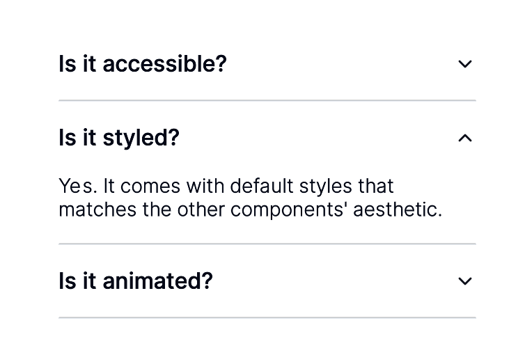

<details>
<summary>Code</summary>

```tsx
import { Text, Container } from '@react-three/uikit'
import { Accordion, AccordionContent, AccordionItem, AccordionTrigger } from '@/accordion.js'

//TODO: type="single" collapsible
export function AccordionDemo() {
  return (
    <Container flexDirection="column" width={300}>
      <Accordion>
        <AccordionItem value="item-1">
          <AccordionTrigger>
            <Text>Is it accessible?</Text>
          </AccordionTrigger>
          <AccordionContent>
            <Text>Yes. It adheres to the WAI-ARIA design pattern.</Text>
          </AccordionContent>
        </AccordionItem>
        <AccordionItem value="item-2">
          <AccordionTrigger>
            <Text>Is it styled?</Text>
          </AccordionTrigger>
          <AccordionContent>
            <Text>Yes. It comes with default styles that matches the other components&apos; aesthetic.</Text>
          </AccordionContent>
        </AccordionItem>
        <AccordionItem value="item-3">
          <AccordionTrigger>
            <Text>Is it animated?</Text>
          </AccordionTrigger>
          <AccordionContent>
            <Text>Yes. It&apos;s animated by default, but you can disable it if you prefer.</Text>
          </AccordionContent>
        </AccordionItem>
      </Accordion>
    </Container>
  )
}

```

</details>

[Live View](https://pmndrs.github.io/uikit/examples/default/?component=accordion)   
```bash
npx uikit component add default accordion
```

## Alert
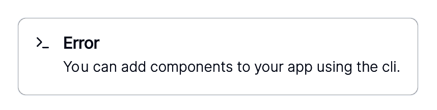

<details>
<summary>Code</summary>

```tsx
import { Text } from '@react-three/uikit'
import { Terminal } from '@react-three/uikit-lucide'
import { Alert, AlertDescription, AlertIcon, AlertTitle } from '@/alert.js'

export function AlertDemo() {
  return (
    <Alert maxWidth={500}>
      <AlertIcon>
        <Terminal width={16} height={16} />
      </AlertIcon>
      <AlertTitle>
        <Text>Error</Text>
      </AlertTitle>
      <AlertDescription>
        <Text>You can add components to your app using the cli.</Text>
      </AlertDescription>
    </Alert>
  )
}

```

</details>

[Live View](https://pmndrs.github.io/uikit/examples/default/?component=alert)   
```bash
npx uikit component add default alert
```

## Alert-dialog
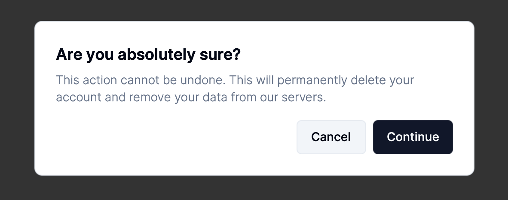

<details>
<summary>Code</summary>

```tsx
import { Text } from '@react-three/uikit'
import { Button } from '@/button.js'
import {
  AlertDialog,
  AlertDialogAction,
  AlertDialogCancel,
  AlertDialogContent,
  AlertDialogDescription,
  AlertDialogFooter,
  AlertDialogHeader,
  AlertDialogTitle,
  AlertDialogTrigger,
} from '@/alert-dialog.js'

export function AlertDialogDemo() {
  return (
    <AlertDialog>
      <AlertDialogTrigger>
        <Button variant="outline">
          <Text>Show Dialog</Text>
        </Button>
      </AlertDialogTrigger>
      <AlertDialogContent>
        <AlertDialogHeader>
          <AlertDialogTitle>
            <Text>Are you absolutely sure?</Text>
          </AlertDialogTitle>
          <AlertDialogDescription>
            <Text>
              This action cannot be undone. This will permanently delete your account and remove your data from our
              servers.
            </Text>
          </AlertDialogDescription>
        </AlertDialogHeader>
        <AlertDialogFooter>
          <AlertDialogCancel>
            <Text>Cancel</Text>
          </AlertDialogCancel>
          <AlertDialogAction>
            <Text>Continue</Text>
          </AlertDialogAction>
        </AlertDialogFooter>
      </AlertDialogContent>
    </AlertDialog>
  )
}

```

</details>

[Live View](https://pmndrs.github.io/uikit/examples/default/?component=alert-dialog)   
```bash
npx uikit component add default alert-dialog
```

## Avatar


<details>
<summary>Code</summary>

```tsx
import { Container } from '@react-three/uikit'
import { Avatar } from '@/avatar.js'

export function AvatarDemo() {
  return (
    <Container alignItems="center">
      <Avatar src="https://picsum.photos/100/100" />
    </Container>
  )
}

```

</details>

[Live View](https://pmndrs.github.io/uikit/examples/default/?component=avatar)   
```bash
npx uikit component add default avatar
```

## Badge


<details>
<summary>Code</summary>

```tsx
import { Text } from '@react-three/uikit'
import { Badge } from '@/badge.js'

export function BadgeDemo() {
  return (
    <Badge>
      <Text>Badge</Text>
    </Badge>
  )
}

```

</details>

[Live View](https://pmndrs.github.io/uikit/examples/default/?component=badge)   
```bash
npx uikit component add default badge
```

## Button
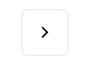

<details>
<summary>Code</summary>

```tsx
import { ChevronRight } from '@react-three/uikit-lucide'
import { Button } from '@/button.js'

export function ButtonDemo() {
  return (
    <Button variant="outline" size="icon">
      <ChevronRight width={16} height={16} />
    </Button>
  )
}

```

</details>

[Live View](https://pmndrs.github.io/uikit/examples/default/?component=button)   
```bash
npx uikit component add default button
```

## Card
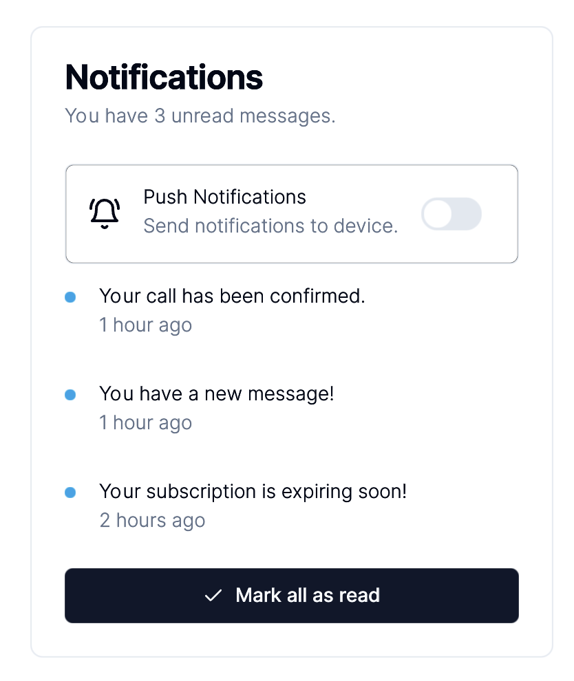

<details>
<summary>Code</summary>

```tsx
import { Text, Container } from '@react-three/uikit'
import { BellRing, Check } from '@react-three/uikit-lucide'
import { colors } from '@/theme.js'
import { Button } from '@/button.js'
import { Card, CardContent, CardDescription, CardFooter, CardHeader, CardTitle } from '@/card.js'
import { Switch } from '@/switch.js'

const notifications = [
  {
    title: 'Your call has been confirmed.',
    description: '1 hour ago',
  },
  {
    title: 'You have a new message!',
    description: '1 hour ago',
  },
  {
    title: 'Your subscription is expiring soon!',
    description: '2 hours ago',
  },
]

export function CardDemo() {
  return (
    <Card width={380}>
      <CardHeader>
        <CardTitle>
          <Text>Notifications</Text>
        </CardTitle>
        <CardDescription>
          <Text>You have 3 unread messages.</Text>
        </CardDescription>
      </CardHeader>
      <CardContent flexDirection="column" gap={16}>
        <Container flexDirection="row" alignItems="center" gap={16} borderRadius={6} borderWidth={1} padding={16}>
          <BellRing />
          <Container flexDirection="column" gap={4}>
            <Text fontSize={14} lineHeight="100%">
              Push Notifications
            </Text>
            <Text fontSize={14} lineHeight={20} color={colors.mutedForeground}>
              Send notifications to device.
            </Text>
          </Container>
          <Switch />
        </Container>
        <Container flexDirection="column">
          {notifications.map((notification, index) => (
            <Container
              key={index}
              marginBottom={index === notifications.length - 1 ? 0 : 16}
              paddingBottom={index === notifications.length - 1 ? 0 : 16}
              alignItems="flex-start"
              flexDirection="row"
              gap={17}
            >
              <Container height={8} width={8} transformTranslateY={4} borderRadius={1000} backgroundColor={0x0ea5e9} />
              <Container flexDirection="column" gap={4}>
                <Text fontSize={14} lineHeight="100%">
                  {notification.title}
                </Text>
                <Text fontSize={14} lineHeight={20} color={colors.mutedForeground}>
                  {notification.description}
                </Text>
              </Container>
            </Container>
          ))}
        </Container>
      </CardContent>
      <CardFooter>
        <Button flexDirection="row" width="100%">
          <Check marginRight={8} height={16} width={16} />
          <Text>Mark all as read</Text>
        </Button>
      </CardFooter>
    </Card>
  )
}

```

</details>

[Live View](https://pmndrs.github.io/uikit/examples/default/?component=card)   
```bash
npx uikit component add default card
```

## Checkbox


<details>
<summary>Code</summary>

```tsx
import { Text, Container } from '@react-three/uikit'
import { Checkbox } from '@/checkbox.js'
import { Label } from '@/label.js'

export function CheckboxDemo() {
  return (
    <Container flexDirection="row" gap={8} alignItems="center">
      <Checkbox />
      <Label>
        <Text>Accept terms and conditions</Text>
      </Label>
    </Container>
  )
}

```

</details>

[Live View](https://pmndrs.github.io/uikit/examples/default/?component=checkbox)   
```bash
npx uikit component add default checkbox
```

## Dialog
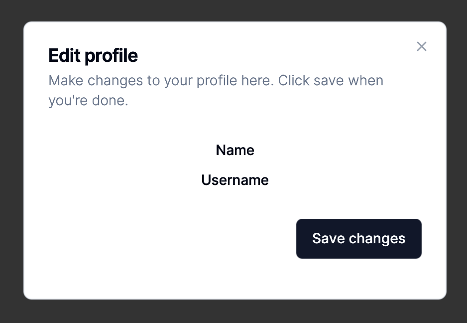

<details>
<summary>Code</summary>

```tsx
import { Text, Container } from '@react-three/uikit'
import { Button } from '@/button.js'
import { Label } from '@/label.js'
import {
  Dialog,
  DialogContent,
  DialogDescription,
  DialogFooter,
  DialogHeader,
  DialogTitle,
  DialogTrigger,
} from '@/dialog.js'

export function DialogDemo() {
  return (
    <Dialog>
      <DialogTrigger>
        <Button variant="outline">
          <Text>Edit Profile</Text>
        </Button>
      </DialogTrigger>
      <DialogContent sm={{ maxWidth: 425 }}>
        <DialogHeader>
          <DialogTitle>
            <Text>Edit profile</Text>
          </DialogTitle>
          <DialogDescription>
            <Text>Make changes to your profile here. Click save when you're done.</Text>
          </DialogDescription>
        </DialogHeader>
        <Container flexDirection="column" alignItems="center" gap={16} paddingY={16}>
          <Container alignItems="center" gap={16}>
            <Label>
              <Text textAlign="right">Name</Text>
            </Label>
            {/*<Input defaultValue="Pedro Duarte" className="col-span-3" />*/}
          </Container>
          <Container alignItems="center" gap={16}>
            <Label>
              <Text textAlign="right">Username</Text>
            </Label>
            {/*<Input id="username" defaultValue="@peduarte" className="col-span-3" />*/}
          </Container>
        </Container>
        <DialogFooter>
          <Button>
            <Text>Save changes</Text>
          </Button>
        </DialogFooter>
      </DialogContent>
    </Dialog>
  )
}

```

</details>

[Live View](https://pmndrs.github.io/uikit/examples/default/?component=dialog)   
```bash
npx uikit component add default dialog
```

## Label
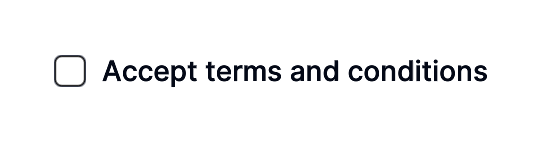

<details>
<summary>Code</summary>

```tsx
import { Text, Container } from '@react-three/uikit'
import { Checkbox } from '@/checkbox.js'
import { Label } from '@/label.js'

export function LabelDemo() {
  return (
    <Container flexDirection="row" gap={8} alignItems="center">
      <Checkbox />
      <Label>
        <Text>Accept terms and conditions</Text>
      </Label>
    </Container>
  )
}

```

</details>

[Live View](https://pmndrs.github.io/uikit/examples/default/?component=label)   
```bash
npx uikit component add default label
```

## Pagination
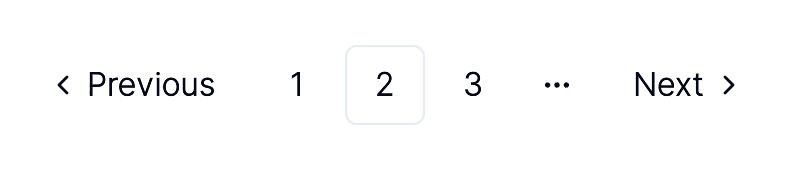

<details>
<summary>Code</summary>

```tsx
import { Text } from '@react-three/uikit'
import {
  Pagination,
  PaginationContent,
  PaginationEllipsis,
  PaginationItem,
  PaginationLink,
  PaginationNext,
  PaginationPrevious,
} from '@/pagination.js'

export function PaginationDemo() {
  return (
    <Pagination>
      <PaginationContent>
        <PaginationItem>
          <PaginationPrevious />
        </PaginationItem>
        <PaginationItem>
          <PaginationLink>
            <Text>1</Text>
          </PaginationLink>
        </PaginationItem>
        <PaginationItem>
          <PaginationLink isActive>
            <Text>2</Text>
          </PaginationLink>
        </PaginationItem>
        <PaginationItem>
          <PaginationLink>
            <Text>3</Text>
          </PaginationLink>
        </PaginationItem>
        <PaginationItem>
          <PaginationEllipsis />
        </PaginationItem>
        <PaginationItem>
          <PaginationNext />
        </PaginationItem>
      </PaginationContent>
    </Pagination>
  )
}

```

</details>

[Live View](https://pmndrs.github.io/uikit/examples/default/?component=pagination)   
```bash
npx uikit component add default pagination
```

## Progress
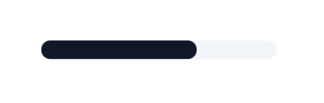

<details>
<summary>Code</summary>

```tsx
import { useEffect, useState } from 'react'
import { Progress } from '@/progress.js'

export function ProgressDemo() {
  const [progress, setProgress] = useState(13)

  useEffect(() => {
    const timer = setTimeout(() => setProgress(66), 500)
    return () => clearTimeout(timer)
  }, [])

  return <Progress value={progress} width={200} />
}

```

</details>

[Live View](https://pmndrs.github.io/uikit/examples/default/?component=progress)   
```bash
npx uikit component add default progress
```

## Radio-group
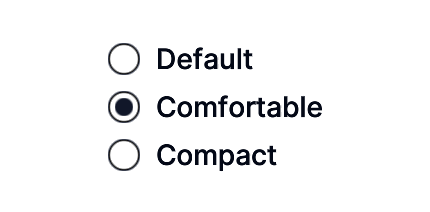

<details>
<summary>Code</summary>

```tsx
import { Text } from '@react-three/uikit'
import { Label } from '@/label.js'
import { RadioGroup, RadioGroupItem } from '@/radio-group.js'

export function RadioGroupDemo() {
  return (
    <RadioGroup defaultValue="comfortable">
      <RadioGroupItem value="default">
        <Label>
          <Text>Default</Text>
        </Label>
      </RadioGroupItem>
      <RadioGroupItem value="comfortable">
        <Label>
          <Text>Comfortable</Text>
        </Label>
      </RadioGroupItem>
      <RadioGroupItem value="compact">
        <Label>
          <Text>Compact</Text>
        </Label>
      </RadioGroupItem>
    </RadioGroup>
  )
}

```

</details>

[Live View](https://pmndrs.github.io/uikit/examples/default/?component=radio-group)   
```bash
npx uikit component add default radio-group
```

## Separator
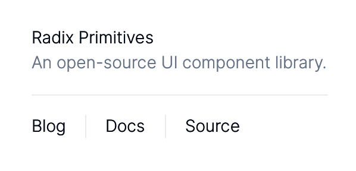

<details>
<summary>Code</summary>

```tsx
import { DefaultProperties, Text, Container } from '@react-three/uikit'
import { colors } from '@/theme.js'
import { Separator } from '@/separator.js'

export function SeparatorDemo() {
  return (
    <Container width={300} flexDirection="column">
      <Container flexDirection="column" gap={4}>
        <Text fontSize={14} lineHeight="100%">
          Radix Primitives
        </Text>
        <Text fontSize={14} lineHeight={20} color={colors.mutedForeground}>
          An open-source UI component library.
        </Text>
      </Container>
      <Separator marginY={16} />
      <Container flexDirection="row" height={20} alignItems="center" gap={16}>
        <DefaultProperties fontSize={14} lineHeight={20}>
          <Text>Blog</Text>
          <Separator orientation="vertical" />
          <Text>Docs</Text>
          <Separator orientation="vertical" />
          <Text>Source</Text>
        </DefaultProperties>
      </Container>
    </Container>
  )
}

```

</details>

[Live View](https://pmndrs.github.io/uikit/examples/default/?component=separator)   
```bash
npx uikit component add default separator
```

## Skeleton
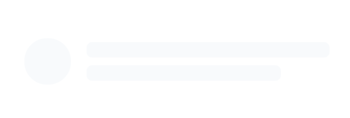

<details>
<summary>Code</summary>

```tsx
import { Container } from '@react-three/uikit'
import { Skeleton } from '@/skeleton.js'

export function SkeletonDemo() {
  return (
    <Container flexDirection="row" alignItems="center" gap={16}>
      <Skeleton borderRadius={1000} height={48} width={48} />
      <Container flexDirection="column" gap={8}>
        <Skeleton height={16} width={250} />
        <Skeleton height={16} width={200} />
      </Container>
    </Container>
  )
}

```

</details>

[Live View](https://pmndrs.github.io/uikit/examples/default/?component=skeleton)   
```bash
npx uikit component add default skeleton
```

## Slider
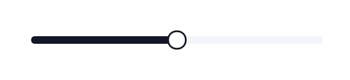

<details>
<summary>Code</summary>

```tsx
import { Slider } from '@/slider.js'

export function SliderDemo() {
  return <Slider defaultValue={50} max={100} step={1} width={300} />
}

```

</details>

[Live View](https://pmndrs.github.io/uikit/examples/default/?component=slider)   
```bash
npx uikit component add default slider
```

## Switch
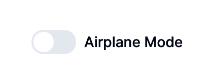

<details>
<summary>Code</summary>

```tsx
import { Text, Container } from '@react-three/uikit'
import { Label } from '@/label.js'
import { Switch } from '@/switch.js'

export function SwitchDemo() {
  return (
    <Container flexDirection="row" alignItems="center" gap={8}>
      <Switch />
      <Label>
        <Text>Airplane Mode</Text>
      </Label>
    </Container>
  )
}

```

</details>

[Live View](https://pmndrs.github.io/uikit/examples/default/?component=switch)   
```bash
npx uikit component add default switch
```

## Tabs
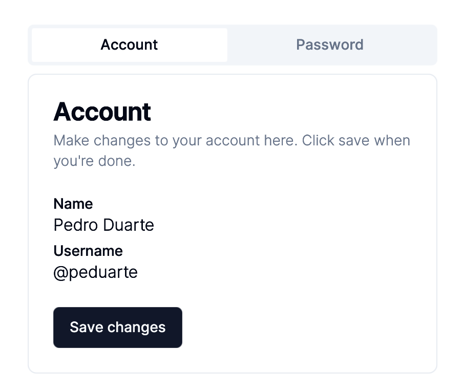

<details>
<summary>Code</summary>

```tsx
import { Text, Container } from '@react-three/uikit'
import { Button } from '@/button.js'
import { Card, CardContent, CardDescription, CardFooter, CardHeader, CardTitle } from '@/card.js'
import { Label } from '@/label.js'
import { Tabs, TabsContent, TabsList, TabsTrigger } from '@/tabs.js'

export function TabsDemo() {
  return (
    <Tabs defaultValue="account" width={400}>
      <TabsList width="100%">
        <TabsTrigger flexGrow={1} value="account">
          <Text>Account</Text>
        </TabsTrigger>
        <TabsTrigger flexGrow={1} value="password">
          <Text>Password</Text>
        </TabsTrigger>
      </TabsList>
      <TabsContent value="account">
        <Card>
          <CardHeader>
            <CardTitle>
              <Text>Account</Text>
            </CardTitle>
            <CardDescription>
              <Text>Make changes to your account here. Click save when you're done.</Text>
            </CardDescription>
          </CardHeader>
          <CardContent flexDirection="column" gap={8}>
            <Container flexDirection="column" gap={4}>
              <Label>
                <Text>Name</Text>
              </Label>
              <Text>Pedro Duarte</Text>
            </Container>
            <Container flexDirection="column" gap={4}>
              <Label>
                <Text>Username</Text>
              </Label>
              <Text>@peduarte</Text>
            </Container>
          </CardContent>
          <CardFooter>
            <Button>
              <Text>Save changes</Text>
            </Button>
          </CardFooter>
        </Card>
      </TabsContent>
      <TabsContent value="password">
        <Card>
          <CardHeader>
            <CardTitle>
              <Text>Password</Text>
            </CardTitle>
            <CardDescription>
              <Text>Change your password here. After saving, you'll be logged out.</Text>
            </CardDescription>
          </CardHeader>
          <CardContent flexDirection="column" gap={8}>
            <Container flexDirection="column" gap={4}>
              <Label>
                <Text>Current password</Text>
              </Label>
              <Text>password</Text>
            </Container>
            <Container flexDirection="column" gap={4}>
              <Label>
                <Text>New password</Text>
              </Label>
              <Text>password</Text>
            </Container>
          </CardContent>
          <CardFooter>
            <Button>
              <Text>Save password</Text>
            </Button>
          </CardFooter>
        </Card>
      </TabsContent>
    </Tabs>
  )
}

```

</details>

[Live View](https://pmndrs.github.io/uikit/examples/default/?component=tabs)   
```bash
npx uikit component add default tabs
```

## Toggle
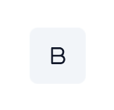

<details>
<summary>Code</summary>

```tsx
import { Bold } from '@react-three/uikit-lucide'
import { Toggle } from '@/toggle.js'

export function ToggleDemo() {
  return (
    <Toggle>
      <Bold height={16} width={16} />
    </Toggle>
  )
}

```

</details>

[Live View](https://pmndrs.github.io/uikit/examples/default/?component=toggle)   
```bash
npx uikit component add default toggle
```

## Toggle-group
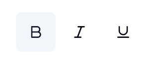

<details>
<summary>Code</summary>

```tsx
import { Bold, Italic, Underline } from '@react-three/uikit-lucide'
import { ToggleGroup, ToggleGroupItem } from '@/toggle-group.js'

export function ToggleGroupDemo() {
  return (
    <ToggleGroup>
      <ToggleGroupItem aria-label="Toggle bold">
        <Bold height={16} width={16} />
      </ToggleGroupItem>
      <ToggleGroupItem aria-label="Toggle italic">
        <Italic height={16} width={16} />
      </ToggleGroupItem>
      <ToggleGroupItem aria-label="Toggle underline">
        <Underline width={16} height={16} />
      </ToggleGroupItem>
    </ToggleGroup>
  )
}

```

</details>

[Live View](https://pmndrs.github.io/uikit/examples/default/?component=toggle-group)   
```bash
npx uikit component add default toggle-group
```

## Tooltip
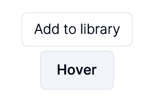

<details>
<summary>Code</summary>

```tsx
import { Text } from '@react-three/uikit'
import { Button } from '@/button.js'
import { Tooltip, TooltipContent, TooltipTrigger } from '@/tooltip.js'

export function TooltipDemo() {
  return (
    <Tooltip>
      <TooltipTrigger>
        <Button variant="outline">
          <Text>Hover</Text>
        </Button>
      </TooltipTrigger>
      <TooltipContent>
        <Text>Add to library</Text>
      </TooltipContent>
    </Tooltip>
  )
}

```

</details>

[Live View](https://pmndrs.github.io/uikit/examples/default/?component=tooltip)   
```bash
npx uikit component add default tooltip
```

## Input


<details>
<summary>Code</summary>

```tsx
import { Input } from '@/input.js'

export default function InputDemo() {
  return <Input width={200} placeholder="Email" />
}

```

</details>

[Live View](https://pmndrs.github.io/uikit/examples/default/?component=input)   
```bash
npx uikit component add default input
```

## Video
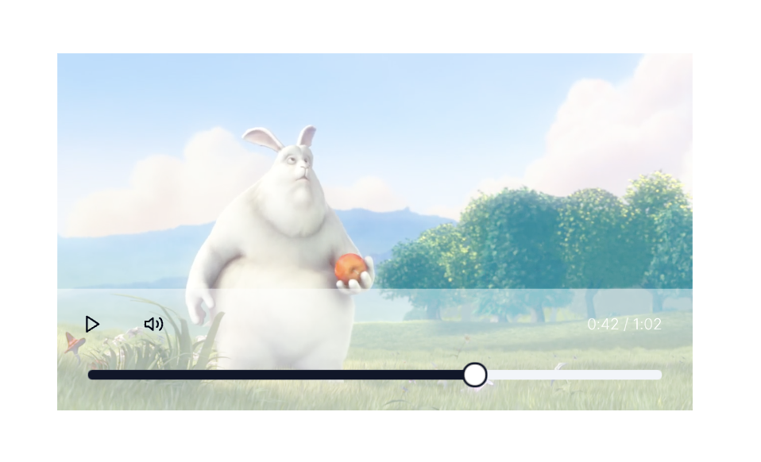

<details>
<summary>Code</summary>

```tsx
import { Video } from '@/video.js'

export function VideoDemo() {
  return <Video src="example.mp4" controls width={500} />
}

```

</details>

[Live View](https://pmndrs.github.io/uikit/examples/default/?component=video)   
```bash
npx uikit component add default video
```

