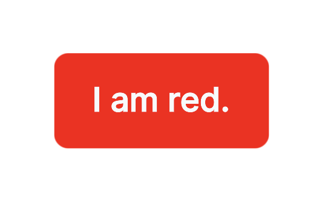

When installing components from any kit, the `uikit cli` always adds a `theme.tsx` file. The values inside this file can be freely adapted to create a custom theme.

For instance, when installing a `Button` from the `default` kit, the primary color of the theme can be modified as seen in the follwing.

```js
export const colors = basedOnPreferredColorScheme({
  light: {
    ...
    primary: "red"
    ...
  },
  ...
})
```

With the following code

```jsx
import { Canvas } from "@react-three/fiber";
import { OrbitControls } from "@react-three/drei";
import { Root, Text, setPreferredColorScheme } from "@react-three/uikit";
import { createRoot } from "react-dom/client";
import { Button } from "./components/button";
import { Defaults } from "./components/theme";

setPreferredColorScheme("light");

createRoot(document.getElementById("root")).render(
  <Canvas camera={{ position: [0, 0, 0.5] }}>
    <OrbitControls />
    <Root>
      <Defaults>
        <Button>
          <Text>I am red.</Text>
        </Button>
      </Defaults>
    </Root>
  </Canvas>
);
```

the following result the following result is achieved.

