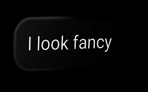

uikit allows to provide custom material classes for the background and border on the `Text`, `Container`, and `Image` components. This allows to change the appearance and use more complex (and computationally expensive) materials such as a `MeshPhysicalMaterial`.

In the following example, we are creating a text element with a material based on the phong material with high specular and shininess. Using the border properties, we can create a border that creates the illusion of a 3D Mesh. Specifically, the `borderBend` property allows bending the normals on the border to create this effect efficiently.



To achieve this look, we are importing the necessary dependencies.

```tsx
import { Canvas } from '@react-three/fiber'
import { OrbitControls } from '@react-three/drei'
import { Root, Text } from '@react-three/uikit'
import { MeshPhongMaterial } from 'three'
```

Then, we create a class for the material we want to adapt by changingthe default values. 

```tsx
class FancyMaterial extends MeshPhongMaterial {
  constructor() {
    super({
      specular: 0x111111,
      shininess: 100,
    })
  }
}
```

Lastly, the UI can be defined using a `Root` and `Text` component.

```tsx
export default function App() {
  return (
    <Canvas>
      <OrbitControls />
      <Root>
        <Text
          backgroundColor="black"
          color="white"
          padding={24}
          borderRadius={32}
          fontSize={32}
          borderColor="black"
          borderBend={0.3}
          borderWidth={8}
          panelMaterialClass={FancyMaterial}
        >
          I look fancy
        </Text>
      </Root>
    </Canvas>
  )
}
```
